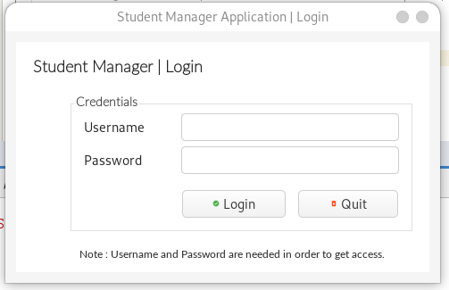
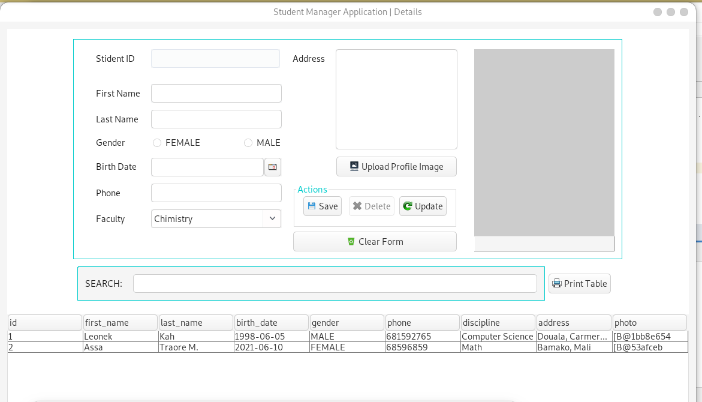
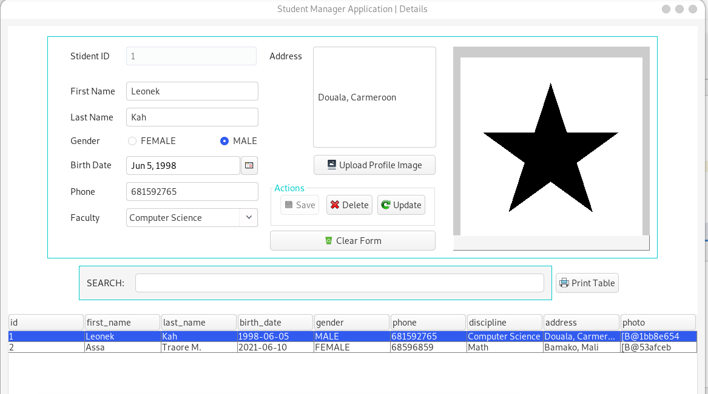

# Dummy Java wing Project

## Description
Simple Java Swing application showing how to use basic components, third party libraries to build a student management system.

## Technologies
* Java 8+
* Java Swing API
* MySQL
* JCalendar 1.4
* rs2xml
* thumbnailator 0.4.8

## Credit
Happy Coding! :)

## Screenshot

### Login

### Overview

### Details Loaded

